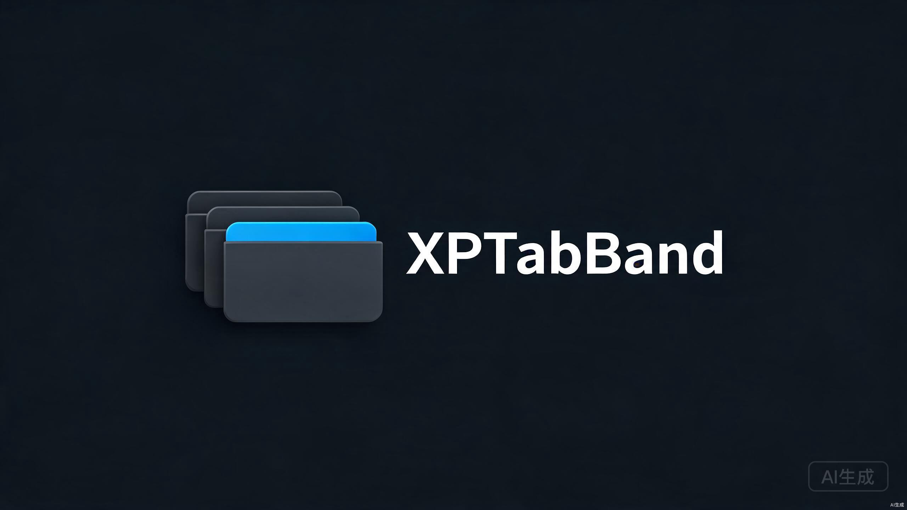
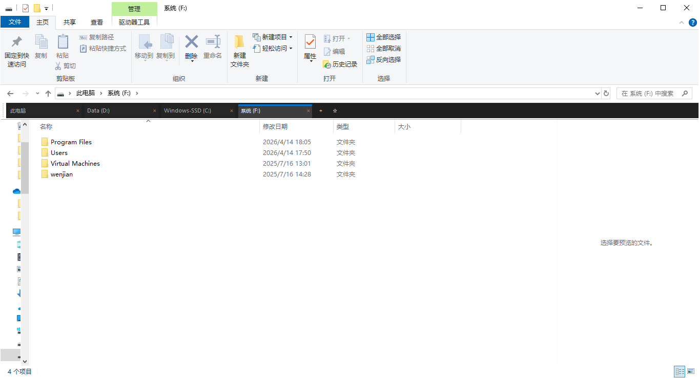
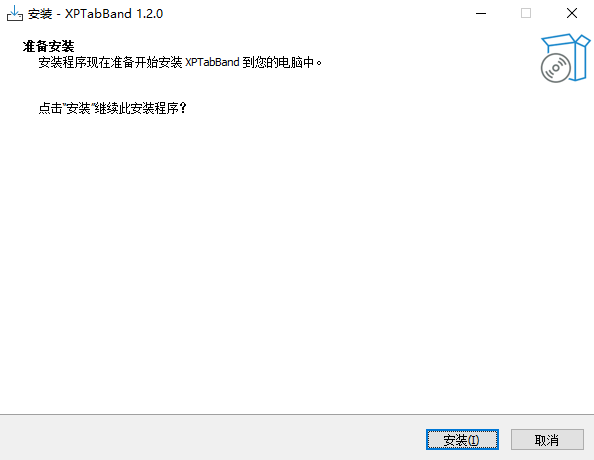
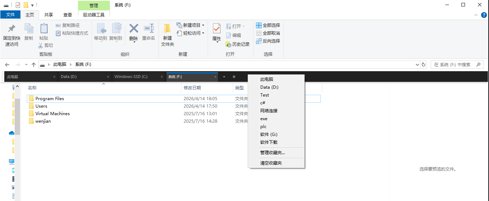
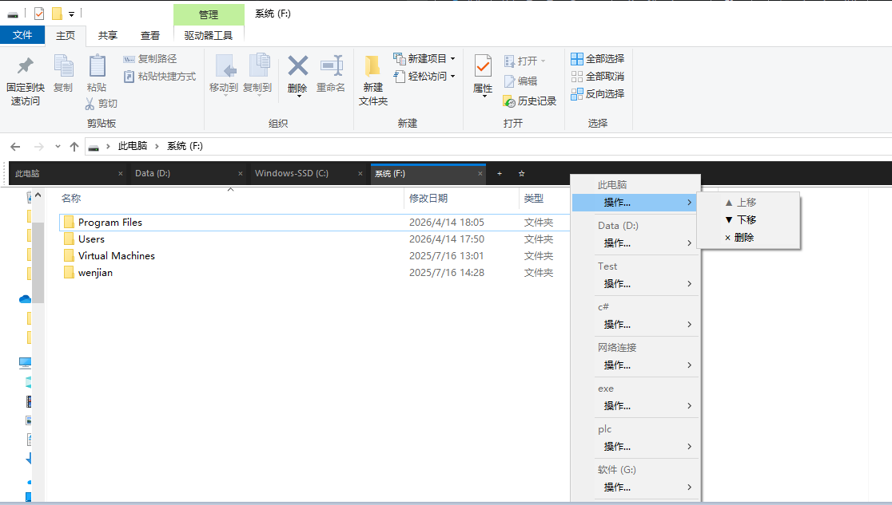
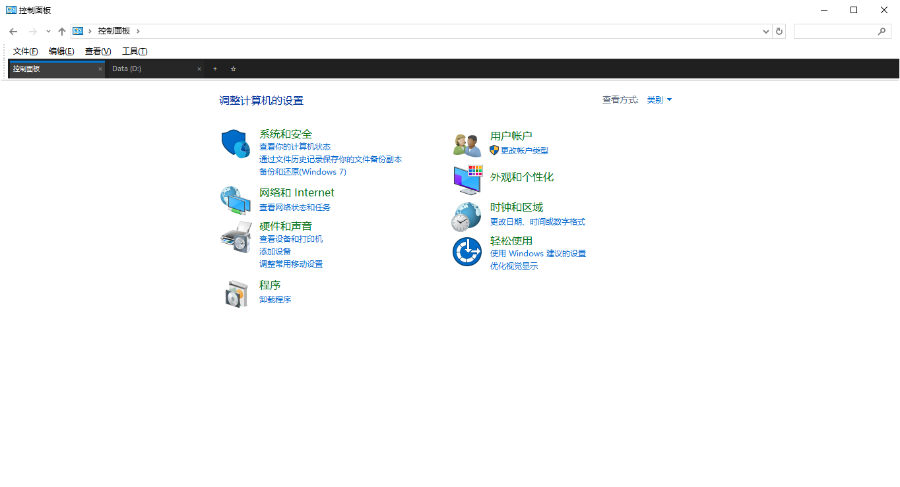
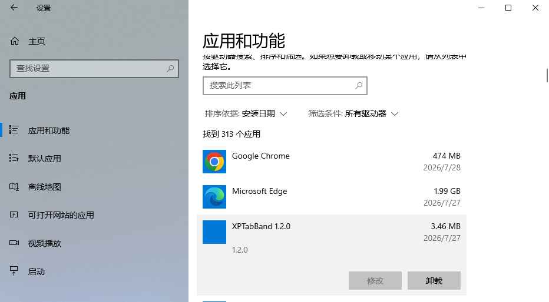

# XPTabBand



为 Windows 资源管理器添加类似 Chrome/Edge 的多标签页工具栏，支持收藏夹管理。



[](LICENSE)
[](#系统要求)
[](#从源码编译)
[](CHANGELOG.md)
[](CONTRIBUTING.md)
[](https://github.com/xp7777/XPTabBand/releases)
[](https://gitee.com/yxp1108/XPTabBand)

> **GitHub**: https://github.com/xp7777/XPTabBand ｜ **Gitee 镜像**: https://gitee.com/yxp1108/XPTabBand

## 目录

- [功能特性](#功能特性)
- [系统要求](#系统要求)
- [安装](#安装)
- [使用](#使用)
- [卸载](#卸载)
- [项目结构](#项目结构)
- [从源码编译](#从源码编译)
- [技术原理](#技术原理)
- [已知限制](#已知限制)
- [常见问题](#常见问题)
- [贡献](#贡献)
- [社区文档](#社区文档)
- [开发历程](#开发历程)
- [致谢](#致谢)
- [License](#license)

## 功能特性

- **多标签页**：在一个资源管理器窗口中打开多个文件夹标签
- **暗色主题 UI**：现代化深色标签栏，顶部蓝色高亮条标识激活标签
- **收藏夹**：右键标签栏空白处快速访问收藏的文件夹
- **收藏夹管理**：上移/下移/删除收藏项，操作后菜单自动重新弹出便于连续操作
- **特殊文件夹支持**：可正常显示控制面板子项、网络连接等特殊位置
- **标准 EXE 安装包**：基于 Inno Setup，注册到"程序和功能"卸载列表
- **PIDL 持久化**：收藏夹用 Shell PIDL 存储，支持移动后的文件夹和特殊位置


## 系统要求

- Windows 10 64 位 / Windows 11
- x64 架构（不支持 32 位系统）
- 安装/卸载需管理员权限

## 安装

### 方式一：标准 EXE 安装（推荐）

从 [Releases](https://github.com/xp7777/XPTabBand/releases) 下载 `XPTabBand-x.x.x-setup.exe`：

1. 双击运行 setup.exe，授权 UAC
2. 跟随向导完成安装
3. 打开任意文件夹窗口
4. 顶部菜单栏 **右键** → **"查看"** → **"工具栏"** → 勾选 **"XPTabBand"**



### 方式二：BAT 脚本安装

下载 [deploy](XPTabCpp/deploy) 目录内容后：

1. **右键** `install.bat` → **"以管理员身份运行"**
2. 按方式一的步骤 3-4 勾选工具栏

详细安装说明见 [deploy/README.md](XPTabCpp/deploy/README.md)。

## 使用

### 基本操作

| 操作 | 动作 |
|------|------|
| 新建标签 | 点击 `+` 按钮 |
| 关闭标签 | 点击标签 `×` |
| 切换标签 | 点击标签主体 |
| 添加到收藏夹 | 左键 `☆` 按钮 |
| 打开收藏菜单 | 右键标签栏黑色空白区域 |

### 收藏夹菜单

**主菜单**：



- 点击收藏项 → 在新标签打开该文件夹
- "管理收藏夹..." → 进入管理菜单

**管理菜单**（操作后自动重新弹出，可连续操作）：



- ▲ 上移 / ▼ 下移 → 调整顺序
- × 删除 → 移除收藏项
- ◀ 返回主菜单

### 特殊文件夹支持

支持普通文件夹和特殊文件夹：

- 普通文件夹（`C:\Users`、`D:\Photos` 等）
- 控制面板项（`控制面板\网络和 Internet\网络连接`）
- 此电脑、网络、回收站等虚拟文件夹



## 卸载

- **EXE 安装方式**：设置 → 应用 → 已安装的应用 → "XPTabBand x.x.x" → 卸载
- **BAT 安装方式**：右键 `uninstall.bat` → 以管理员身份运行



卸载向导会询问是否保留收藏夹数据（`%APPDATA%\XPTabCpp\favorites.dat`）。

## 项目结构

```
XPTabCpp/
├── XPTabBand/              主程序（DeskBand COM 组件）
│   ├── XPTabBandClass.*    COM 接口实现（IDeskBand2 等）
│   ├── TabBarUI.*          标签栏 UI 与逻辑
│   ├── dllmain.cpp         DllRegisterServer / DllUnregisterServer
│   └── XPTabBand.def       模块定义
├── XPTabHook/              早期 DLL 注入方案（已弃用，保留作参考）
├── XPTabInject/            早期注入器（已弃用）
├── MinHook/                MinHook 库（用于早期注入方案）
├── deploy/                 简易部署包（DLL + BAT 脚本）
└── installer/              Inno Setup 安装项目
    └── XPTabBand.iss       安装脚本
```

## 从源码编译

### 编译 DLL

**前置条件**：Visual Studio 2022（含 C++ 桌面开发工作负载）

```cmd
cd XPTabCpp
MSBuild XPTab.sln /p:Configuration=Release /p:Platform=x64 /t:Rebuild
```

输出：`XPTabCpp\XPTabBand\build\XPTabBand.dll`

> ⚠️ 编译前必须先卸载已注册的 DLL（运行 `deploy\uninstall.bat`），否则文件被 explorer.exe 锁定导致 LNK1104 错误。

### 编译安装包

前置条件：[Inno Setup 6](https://jrsoftware.org/isdl.php)

```cmd
cd XPTabCpp\installer
"C:\Program Files (x86)\Inno Setup 6\ISCC.exe" XPTabBand.iss
```

输出：`XPTabCpp\installer\Output\XPTabBand-x.x.x-setup.exe`

详细架构说明见 [docs/architecture.md](docs/architecture.md)。

## 技术原理

- **实现方式**：COM DeskBand 组件（实现 IDeskBand2 / IObjectWithSite / IPersistStream）
- **集成方式**：Explorer 通过 CoCreateInstance 加载，渲染在工具栏区域
- **导航控制**：通过 IWebBrowser2 / IShellBrowser::BrowseObject 切换文件夹
- **PIDL 持久化**：收藏夹使用 PIDL 二进制格式存储，支持特殊文件夹
- **双缓冲绘制**：使用内存 DC 防止闪烁
- **SEH 异常包装**：COM 调用用 `__try/__except` 保护，避免 Explorer 崩溃

详细架构和关键设计决策见 [docs/architecture.md](docs/architecture.md)。

## 已知限制

- 标签栏占用资源管理器顶部 30 像素高度
- 部分控制面板子项可能在新窗口打开（Windows Shell 限制）
- 仅支持 x64 系统
- 未数字签名，首次运行可能被 SmartScreen 拦截
- 不支持 IE 兼容模式

## 常见问题

> 更完整的 Q&A 见 [docs/FAQ.md](docs/FAQ.md)；遇到具体问题先按 [docs/troubleshooting.md](docs/troubleshooting.md) 收集诊断信息。

### Q1：看不到标签栏？

1. 确认在"查看 → 工具栏"中勾选了 XPTabBand
2. 任务管理器 → 找到"Windows 资源管理器" → 右键 → 重新启动
3. 查看日志 `%LOCALAPPDATA%\Temp\XPTabBand_log.txt` 是否有错误

### Q2：勾选 XPTabBand 后 Explorer 崩溃？

1. 立即取消勾选（如果还能操作）
2. 用任务管理器结束 explorer.exe，再新建任务 explorer.exe
3. 查看 Windows 事件查看器 → Windows 日志 → 应用程序，找 XPTabBand 相关错误
4. 提交 [Issue](https://github.com/xp7777/XPTabBand/issues) 并附上日志

### Q3：SmartScreen 拦截安装包？

点击"更多信息" → "仍要运行"。这是因为未数字签名，非安全问题。

### Q4：杀毒软件拦截？

可能误报 regsvr32 注册 DLL。把安装目录加入白名单即可。

### Q5：安装后 Explorer 卡顿？

可能是日志输出过多。查看 `%LOCALAPPDATA%\Temp\XPTabBand_log.txt` 大小，如超过 10MB，关闭后删除即可。

### Q6：如何彻底卸载？

1. 控制面板 → 程序和功能 → 卸载 XPTabBand
2. （可选）删除收藏夹数据：`%APPDATA%\XPTabCpp\`
3. （可选）删除日志：`%LOCALAPPDATA%\Temp\XPTabBand_log.txt`

## 贡献

欢迎提交 Issue 和 Pull Request！参与前请阅读 [贡献指南](CONTRIBUTING.md) 和 [行为准则](CODE_OF_CONDUCT.md)。

- 报告 Bug：[提交 Issue](https://github.com/xp7777/XPTabBand/issues/new/choose)
- 贡献代码：[贡献指南](CONTRIBUTING.md)
- 版本变更：[CHANGELOG.md](CHANGELOG.md)
- 架构文档：[docs/architecture.md](docs/architecture.md)
- 开发指南：[docs/development.md](docs/development.md)
- 发布流程（维护者）：[docs/release.md](docs/release.md)

### 贡献者

<a href="https://github.com/xp7777/XPTabBand/graphs/contributors">
  
</a>

## 社区文档

| 文档 | 说明 |
| ---- | ---- |
| [CONTRIBUTING.md](CONTRIBUTING.md) | 贡献指南：如何提交 Issue、PR、commit 规范 |
| [CODE_OF_CONDUCT.md](CODE_OF_CONDUCT.md) | 行为准则：参与社区的礼仪规范 |
| [SECURITY.md](SECURITY.md) | 安全策略：如何报告安全漏洞 |
| [SUPPORT.md](SUPPORT.md) | 获取支持：问题求助渠道 |
| [docs/FAQ.md](docs/FAQ.md) | 常见问题详解 |
| [docs/troubleshooting.md](docs/troubleshooting.md) | 故障排查指南（含诊断脚本） |
| [docs/development.md](docs/development.md) | 开发指南：环境搭建、调试技巧、代码规范 |
| [docs/architecture.md](docs/architecture.md) | 技术架构和关键设计决策 |
| [docs/release.md](docs/release.md) | 版本发布流程（维护者） |
| [docs/screenshots.md](docs/screenshots.md) | 截图规范 |

## 开发历程

本项目经过多次方案迭代：

1. **DLL 注入方案**（`XPTabHook/` + `XPTabInject/`）— 跨进程子类化不稳定，弃用
2. **C++ DeskBand**（`XPTabBand/`）— 最终采用方案，参考 QTTabBar 实现

详见 [CHANGELOG.md](CHANGELOG.md)。

## 致谢

- [QTTabBar](https://github.com/indiff/QTTabBar) — BandObject 实现参考，GPL-3.0
- [MinHook](https://github.com/TsudaKageyu/minhook) — 用于早期注入方案的 API Hook 库
- [Inno Setup](https://jrsoftware.org/isinfo.php) — 安装程序制作工具

## Star 历史

<!-- 项目积累 star 后可恢复此段
[](https://star-history.com/#xp7777/XPTabBand&Date)
-->

## License

本项目基于 GPL-3.0 协议开源，参考了 QTTabBar 的 GPL-3.0 代码。详见 [LICENSE](LICENSE)。
